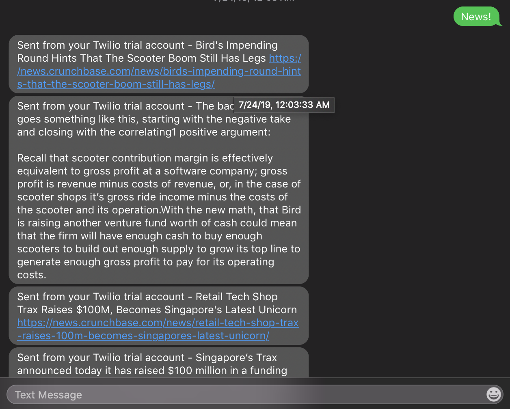

# TextDigest #
A serverless application that sends you a daily digest from your favorite websites, using AWS and Twilio technologies!

## Why build something like this? ##
Convenience. I want something that sends me the news everyday from my favorite websites so that all I need to do is gothrough my text messages and click on the links of the articles I want to read based on their summary. Plus, serverless is cool and allows me to have high load capable services for cheap/free!

## How does it work? ##
Once you set it up on AWS Lambda, every morning at 9 AM the Lambda job gets kicked off and runs through the links.txt file and gathers the maximum number of articles per webpage. It stores that into AWS DynamoDB and gathers logs into AWS CloudWatch Logs. After setting up Twilio and gathering a phone number, once you text the number, the serverless Twilio Functions code will gather the content from DynamoDB and serve it up in XML which is then sent as texts to the user. 

## Tech Stack ##
* Languages Used: Golang & Node.JS
* Amazon Web Services
  * AWS Lambda
  * AWS S3
  * AWS DynamoDB
* Twilio 
  * Twilio Functions
  * Twilio SMS Services

